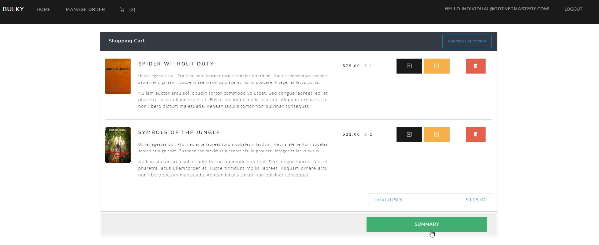
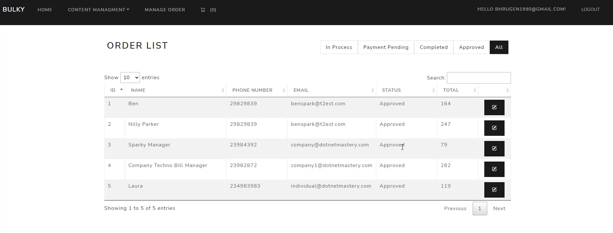
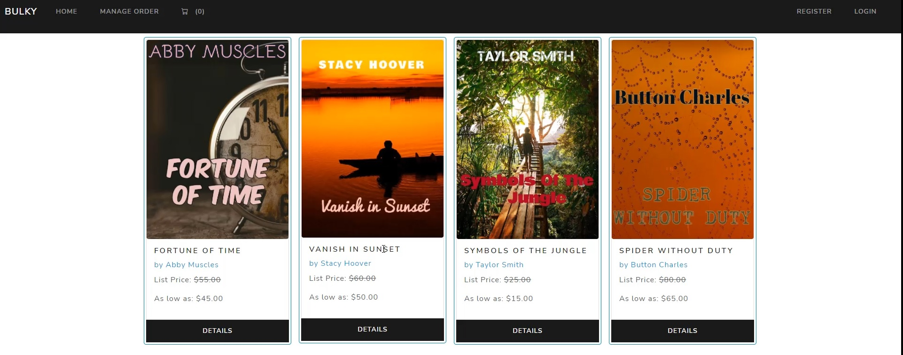

# BulkyBook E-commerce Application
ASP.NET MVC full stack application representing an ecommerce website for a fictional bookstore company 📚💰.

    
    
    

# Objective
The objective of this project was to build a full stack application with the concept of a book shop, the frontend was constructed using Razor pages and the backend using ASP.NET WebAPI with Postgres Database. During implementation, a strong emphasis was put on the architecture, so it follows SOLID principles and best practices for building clean and maintainable code. On the technical side, in summary it encompasses basic CRUD operations integrated to the database through entity framework core and on the user side of the system realized with Model View Controller architecture.

# Skills and Technical Competences 
* Know the structure of ASP NET MVC Core Project
* Know the structure of ASP NET Core Razor Project
* Know the fundamentals of ASP NET MVC Core
* Integrate Identity Framework and learn how to add more fields to Users
* Interact with Razor class library for Identity
* Integrate Entity Framework along with code first migrations
* Sessions in ASP NET Core
* Custom Tag Helpers in ASP NET Core
* View Components and Partial Views in ASP NET Core
* Bootstrap v4
* Authentication and Authorization in ASP NET Core
* Google and Facebook Authentication/Login
* Role Management in ASP NET Core Identity
* Email notifications
* TempData/ViewBag/ViewData in ASP NET Core
* Stripe Payment Integrations
* Repository Pattern to Access Database
* Dapper and Stored Procedure Calls
* Seed Database Migrations Automatically
* Deploying the website on Microsoft Azure

# References
> The complete course can be found here [page](https://www.udemy.com/course/complete-aspnet-core-21-course/). 
